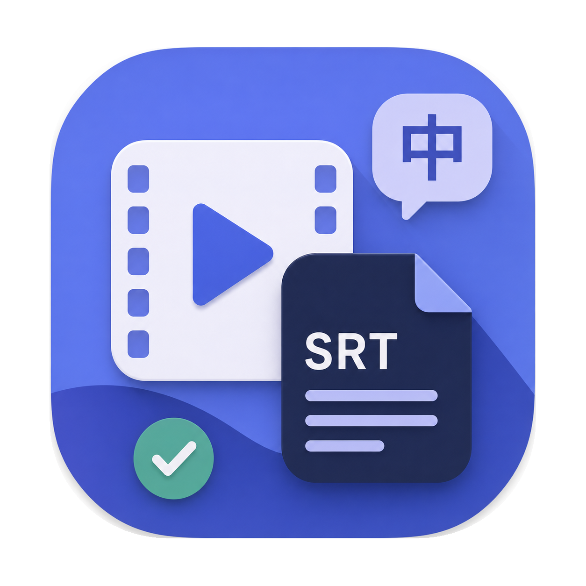
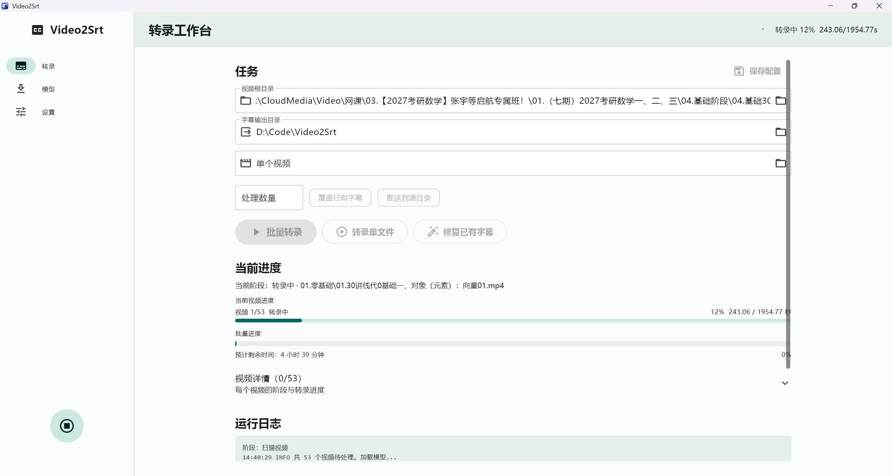
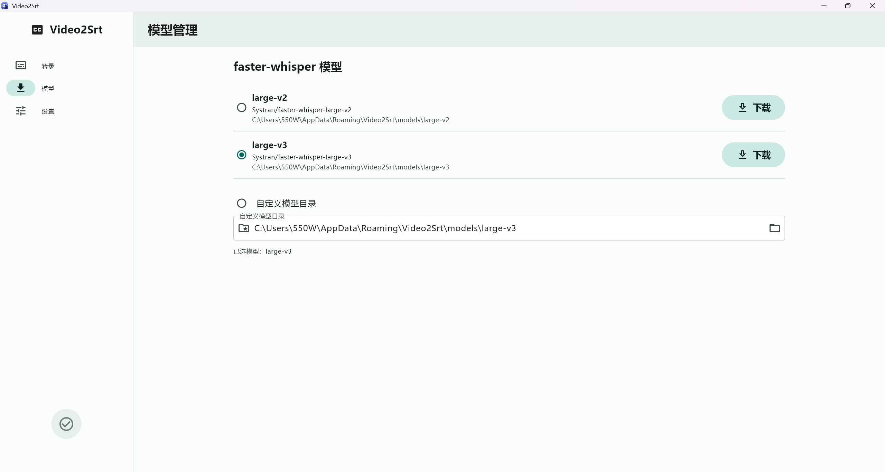
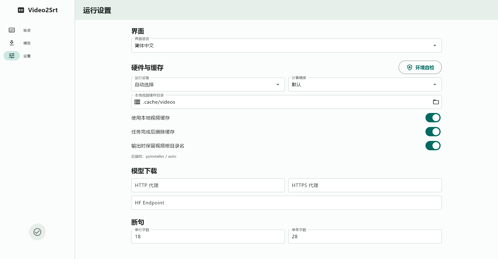

<p align="center">
  
</p>

<h1 align="center">Video2Srt</h1>

<p align="center">
  一款面向 Windows 的纯本地、支持批量的音视频转录与 SRT 字幕生成工具
</p>

<p align="center">
  <a href="https://flutter.dev/"></a>
  <a href="https://www.python.org/"></a>
  <a href="https://github.com/SYSTRAN/faster-whisper"></a>
  <a href="https://github.com/SnowSwordScholar/Video2Srt/releases"></a>
  <a href="LICENSE"></a>
</p>

<p align="center">
  
</p>

## 📖 项目概览

**Video2Srt** 旨在为用户提供开箱即用、安全高效的本地字幕生成体验。它采用前后端分离的设计：以 Flutter (Material 3) 构建优雅流畅的 Windows 桌面操作入口，以 Python 和 `faster-whisper` 作为硬核转录引擎。

**🛡️ 隐私优先，完全离线**：本项目不依赖任何云端 API 转录服务。您的所有视频、音频、模型、缓存以及运行日志均由本地环境严格管理，无需网络即可顺畅运行，彻底杜绝数据泄露风险。

## ✨ 核心特性

- **🚀 高效转录工作台**
  支持多任务批量转录与单文件精准转录。实时展示单视频处理进度及批量任务的预计剩余时间，支持跳过已有字幕、覆盖重跑、以及已有字幕的智能修复与重组。
- **🤖 灵活的模型管理**
  内置模型下载器，支持一键获取 `large-v2` / `large-v3` 等主流模型；同时允许高级用户挂载自定义的 `faster-whisper` 模型目录。
- **⚡ 智能硬件加速**
  自动化运行策略：优先检测并启用 CUDA (GPU) 加速；当环境不可用时，无缝回落至 CPU `int8` 模式，保证在绝大多数 Windows 设备上都能稳定运行。
- **📁 完善的文件处理机制**
  支持自动本地缓存管理，提供“字幕推送回源视频目录”等贴心功能，让输出结果直接与源文件对齐，免去手动整理的烦恼。
- **📦 极简的发布形态**
  通过 PyInstaller 打包后端引擎，并使用 Inno Setup 构建为免环境配置的 Windows 安装包 (`.exe`)。小白用户也能一键安装，即刻使用。

## 📸 界面预览

| 模型管理模块 | 运行设置模块 |
| :---: | :---: |
|  |  |
| *一键下载或管理本地转录模型* | *灵活配置计算设备与转录参数* |

## 🛠️ 技术栈

**前端 (UI)**
- [Flutter](https://flutter.dev/) - 跨平台高性能 UI 框架
- Material 3 Design - 现代化的视觉设计规范

**后端 (AI & 逻辑)**
- Python 3.10+
- [faster-whisper](https://github.com/SYSTRAN/faster-whisper) & [CTranslate2](https://github.com/OpenNMT/CTranslate2) - 核心语音识别与推理引擎

**构建与分发**
- PyInstaller - Python 环境独立打包
- Inno Setup - Windows 安装包制作

## 📂 项目结构

```text
Video2Srt/
├─ flutter_app/          # Flutter Material 3 桌面端源码
├─ transcribe.py         # faster-whisper 转录、字幕重组与进度通信脚本
├─ config.example.json   # 默认应用配置模板
├─ scripts/              # Windows 环境打包与构建脚本
├─ docs/                 # 项目发布、打包与二次开发说明
└─ images/               # README 配图与应用图标资源
```

## 🚀 快速开始

### 针对普通用户 (直接使用)
1. 前往 [Releases 页面](https://github.com/SnowSwordScholar/Video2Srt/releases) 下载最新版本的 `Video2Srt-Installer.exe`。
2. 双击安装后，打开软件。
3. 在“模型管理”中下载或指定模型库，即可开始批量转换你的视频文件！

### 针对开发者 (本地编译)
详细的本地环境搭建、前后端通信协议以及打包流程，请参阅 [开发与构建文档](docs/PACKAGING.md)。

## 📄 许可证

本项目采用 [GNU Affero General Public License v3.0](LICENSE) 开源协议。欢迎提交 Pull Request 或发起 Issue 交流！
