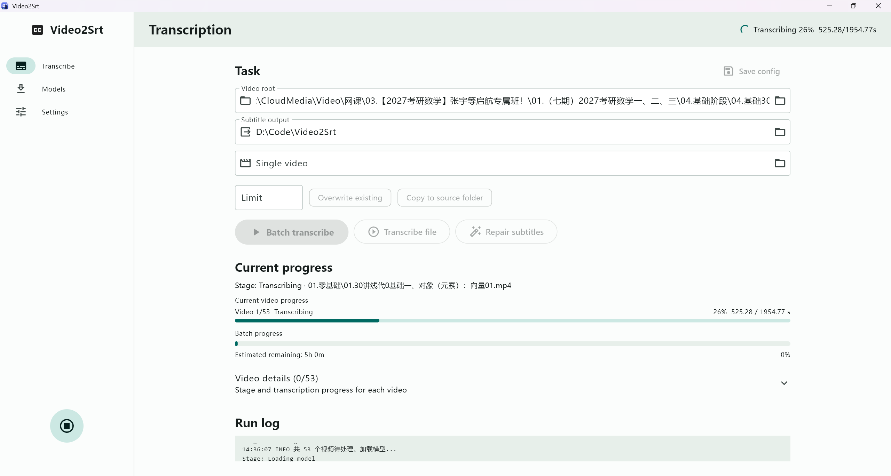
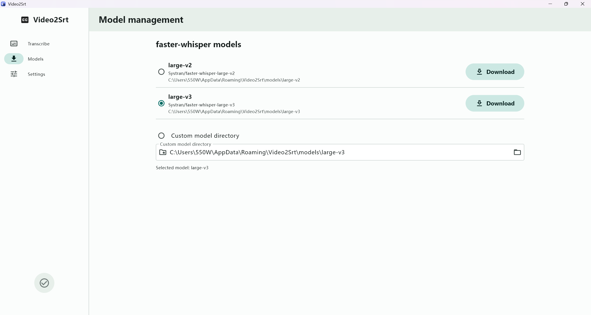
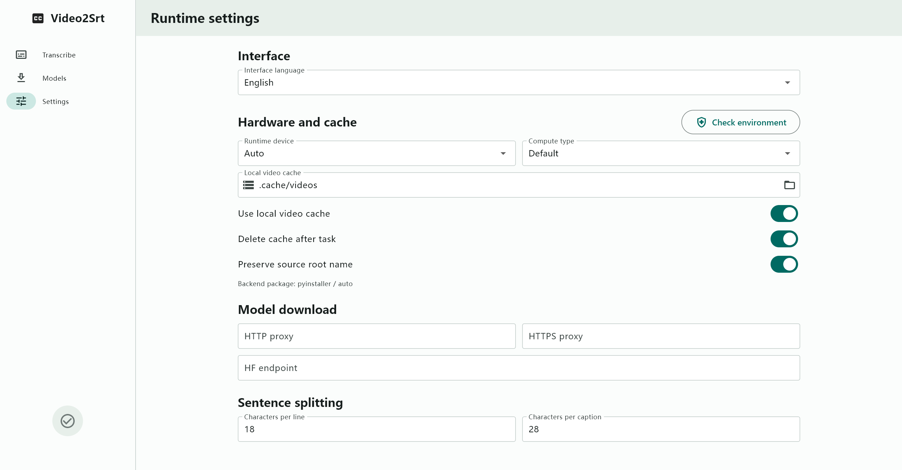

<p align="center">
  
</p>

<h1 align="center">Video2Srt</h1>

<p align="center">
  A fully local, batch-supported audio/video transcription and SRT subtitle generation tool for Windows.
</p>

<p align="center">
  <a href="https://flutter.dev/"></a>
  <a href="https://www.python.org/"></a>
  <a href="https://github.com/SYSTRAN/faster-whisper"></a>
  <a href="https://github.com/SnowSwordScholar/Video2Srt/releases"></a>
  <a href="LICENSE"></a>
</p>

<p align="center">
  
</p>

## 📖 Overview

**Video2Srt** aims to provide an out-of-the-box, secure, and efficient local subtitle generation experience. It features a decoupled frontend-backend architecture: an elegant and fluid Windows desktop UI built with Flutter (Material 3), and a hardcore transcription engine powered by Python and `faster-whisper`.

**🛡️ Privacy First & Completely Offline**: This project does not rely on any cloud-based transcription APIs. All your videos, audio files, models, caches, and runtime logs are strictly managed in your local environment. It runs smoothly without an internet connection, completely eliminating the risk of data leakage.

## ✨ Core Features

- **🚀 Efficient Transcription Workspace**
  Supports both multi-task batch processing and precise single-file transcription. Displays real-time progress for individual videos and estimated remaining time for batch tasks. Supports skipping existing subtitles, force-rerunning, and intelligent repair/recombination of existing subtitles.
- **🤖 Flexible Model Management**
  Built-in model downloader for one-click acquisition of mainstream models like `large-v2` / `large-v3`. Advanced users can also mount custom `faster-whisper` model directories.
- **⚡ Intelligent Hardware Acceleration**
  Automated execution strategy: automatically detects and enables CUDA (GPU) acceleration. When unavailable, it seamlessly falls back to CPU `int8` mode, ensuring stable execution on the vast majority of Windows devices.
- **📁 Comprehensive File Processing**
  Automated local cache management and thoughtful features like "Push subtitles back to the source video directory", aligning the output directly with the source files to save you from manual organization.
- **📦 Minimalist Distribution**
  The backend engine is packaged via PyInstaller and compiled into an environment-free Windows installer (`.exe`) using Inno Setup. Even beginners can install with one click and use it immediately.

## 📸 UI Preview

| Model Management | Runtime Settings |
| :---: | :---: |
|  |  |
| *One-click download or manage local models* | *Flexible configuration for devices and parameters* |

## 🛠️ Tech Stack

**Frontend (UI)**
- [Flutter](https://flutter.dev/) - Cross-platform high-performance UI framework
- Material 3 Design - Modern visual design specifications

**Backend (AI & Logic)**
- Python 3.10+
- [faster-whisper](https://github.com/SYSTRAN/faster-whisper) & [CTranslate2](https://github.com/OpenNMT/CTranslate2) - Core speech recognition and inference engines

**Build & Distribution**
- PyInstaller - Python environment standalone packaging
- Inno Setup - Windows installer creator

## 📂 Project Structure

```text
Video2Srt/
├─ flutter_app/          # Flutter Material 3 desktop client source code
├─ transcribe.py         # faster-whisper transcription, subtitle logic & progress communication
├─ config.example.json   # Default application configuration template
├─ scripts/              # Windows environment packaging and build scripts
├─ docs/                 # Documentation for release, packaging, and development
└─ images/               # README illustrations and app icon resources
```

## 🚀 Quick Start

### For General Users (Direct Use)
1. Go to the [Releases page](https://github.com/SnowSwordScholar/Video2Srt/releases) to download the latest version of `Video2Srt-Installer.exe`.
2. Double-click to install, then open the application.
3. Download or specify a model library in "Model Management", and start batch converting your video files!

### For Developers (Local Build)
For details on local environment setup, frontend-backend communication protocols, and the packaging process, please refer to the [Development and Packaging Documentation](docs/PACKAGING.md).

## 📄 License

This project is licensed under the [GNU Affero General Public License v3.0](LICENSE). Feel free to submit a Pull Request or open an Issue for discussion!
